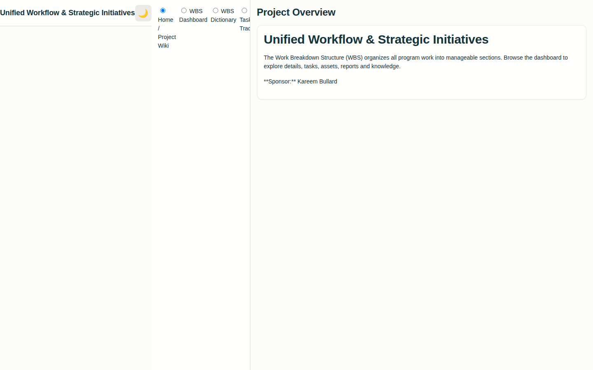

# Unified Workflow & Strategic Initiatives — Portfolio Dashboard

A comprehensive project portfolio management dashboard with a full WBS (Work Breakdown Structure) system, task tracker, asset catalog, and knowledge library — all in a single-page app with dark/light mode toggle.



## Live Demo

**HTML Version (no install needed):**
Open `Unified_Workflow_Strategic_Initiatives_Portfolio_Dashboard.html` directly in your browser — or deploy to GitHub Pages:
```
https://[your-github-username].github.io/wbs-portfolio/Unified_Workflow_Strategic_Initiatives_Portfolio_Dashboard.html
```

> A React/Vite version with TypeScript is also available in this folder for local development (see below).

## Features

- **Home / Project Wiki** — Central project documentation hub
- **WBS Dashboard** — Full work breakdown structure visualization
- **WBS Dictionary** — Definitions and descriptions for each WBS element
- **Task Tracker** — Task management with status and assignments
- **Asset Catalog** — Inventory of project assets and deliverables
- **Reporting Forms** — Structured project reporting
- **Knowledge Library** — Reference documents and resources
- Dark/light mode toggle
- Responsive sidebar navigation with radio-based view switching
- Font: Space Grotesk + Inter + JetBrains Mono
- Font Awesome icons

## Tech Stack

| Layer | Technology |
|---|---|
| HTML Version | Vanilla HTML + CSS + JavaScript |
| React Version | React 18 + TypeScript + Vite |
| Icons | Font Awesome 6 |
| Fonts | Google Fonts |

## React Version — Local Setup

**Prerequisites:** Node.js 18+

```bash
npm install
npm run build   # TypeScript compile + Vite build
npm run preview
```

## Project Structure

```
├── Unified_Workflow_Strategic_Initiatives_Portfolio_Dashboard.html  # ← Deploy this
├── style.css                   # Main styles
├── app.js                      # JavaScript logic
├── src/
│   └── components/             # React component source
├── package.json
└── vite.config.ts
```

## About

Built by Kareem Bullard as part of the King Projects portfolio — a production-grade WBS and portfolio management tool demonstrating advanced dashboard architecture, multi-view navigation, and comprehensive project tracking features.
